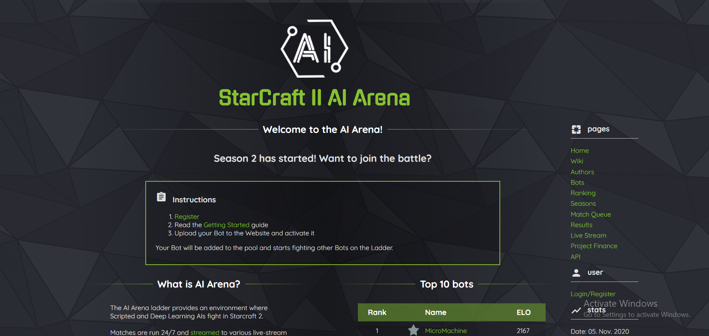
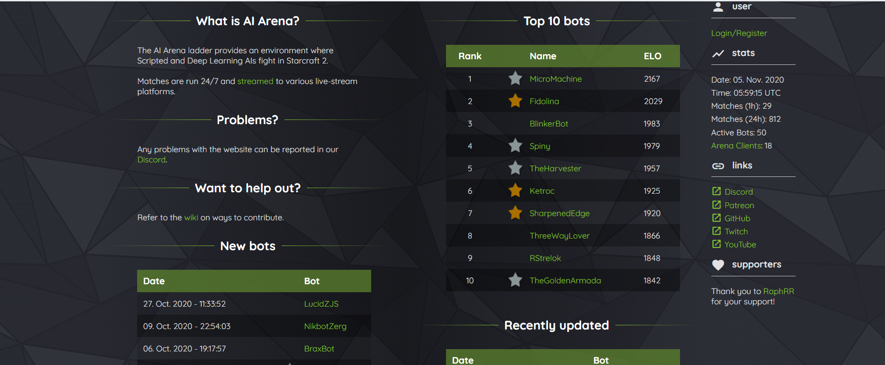

# aiarena-web
This is an amazing website which gives you a sense of thrill and enables you to compete with other bots across the world 

[See the live website here](https://aiarena.net/)

[Dev Install instructions](./doc/INSTALL.md)

## Module structure:
### aiarena/core
Core ladder/project functionality

### aiarena/api
Web API endpoints and functionality

### aiarena/frontend
Django templates are used for the website frontend

## License

Copyright (c) 2019

Licensed under the [GPLv3 license](LICENSE).
